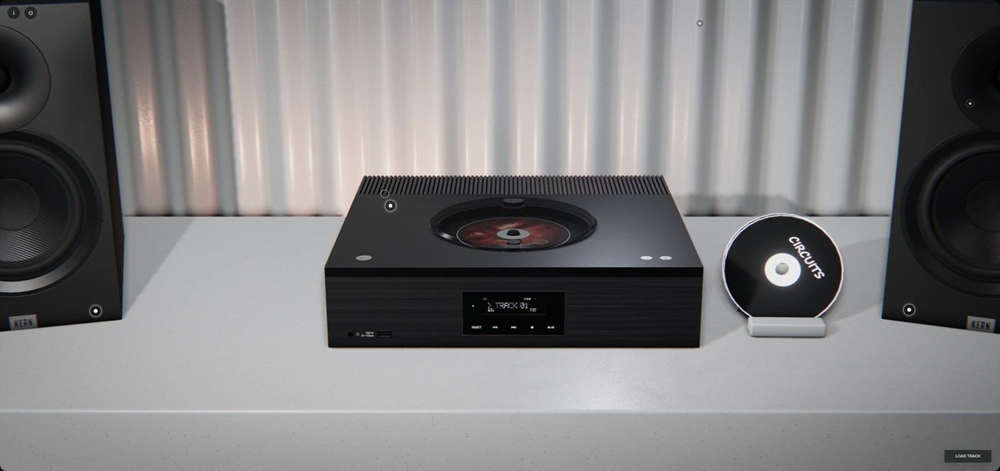
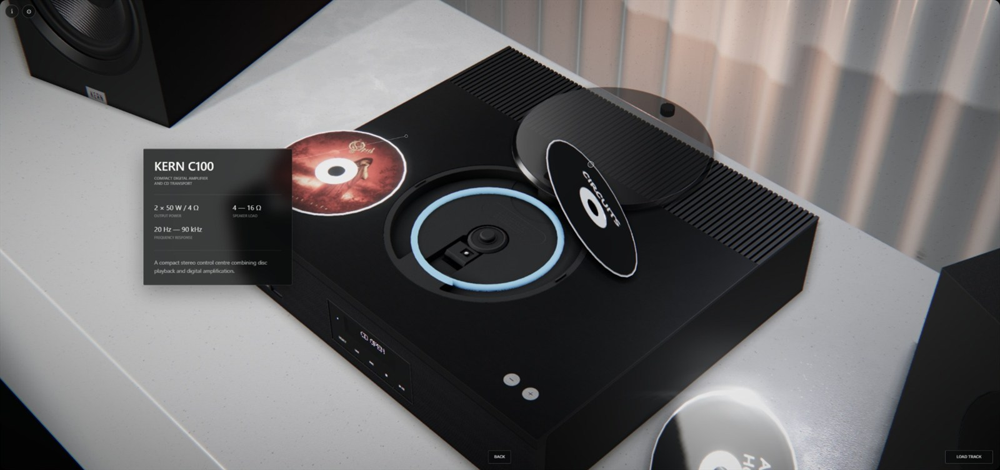

# KERNWERK

<div align="center">
  
  <h3>Interactive 3D Audio System</h3>
  <p>A real-time product study built around a fictional compact stereo system.</p>
  <p><a href="https://lutikri.github.io/web-playersim/"><strong>Launch the live experience</strong></a></p>
</div>



## Overview

KERNWERK is an interactive product visualization rather than a conventional configurator. The scene combines authored camera views, physical CD interaction, spatial audio, product information, and a performance-aware rendering pipeline in one browser experience.

The project is designed to remain usable across integrated graphics, laptops, and high-end GPUs. It starts conservatively, measures the rendered scene, and adjusts quality without requiring the visitor to understand graphics settings.

## Highlights

- Guided camera tour with parallax, points of interest, and anchored product cards
- Physics-based CD dragging, tray attraction, snapping, removal, and lid interaction
- Functional player controls, display states, volume, track selection, and playback
- Local FLAC, WAV, and MP3 loading with multi-track discs and generated disc labels
- Stereo Web Audio playback through separate high- and low-frequency speaker sources
- Audio-reactive speaker membranes and positional player foley
- Progressive KTX2 texture streaming with Low, Medium, High, and cinematic assets
- Adaptive performance profiles for post-processing, lights, shadows, pixel ratio, and texture quality
- In-browser level editor for objects, lights, materials, post-processing, and saved level overrides



## Controls

| Action | Input |
| --- | --- |
| Open a product view | Select a camera point of interest |
| Return to the overview | `Back` or `Esc` |
| Interact with the player | Click its physical controls or CD lid |
| Move a disc | Drag it with the pointer |
| Create a custom disc | Use `Load track` or drop audio files onto the page |
| Free camera in debug mode | `WASD`, `Q` / `E`, and right-mouse look |

The file picker accepts up to 20 tracks per disc, with a maximum duration of 15 minutes per track.

## Quick Start

Requirements: a current Node.js release and npm.

```bash
npm install
npm run dev
```

Vite prints the local URL and reloads the scene when source files change. To expose the development server on the local network:

```bash
npm run dev -- --host 0.0.0.0
```

Build and inspect the production bundle locally:

```bash
npm run build
npm run preview
```

Run the automated checks:

```bash
npm run check
```

## Asset Pipeline

Editable source assets live in the ignored `assets-source/` directory. Browser-ready models, textures, and audio are generated or copied into `assets/` and committed so GitHub Pages can serve the project directly.

| Command | Purpose |
| --- | --- |
| `npm run textures` | Generate the normal runtime texture tiers |
| `npm run textures:4k` | Rebuild the 4K tier |
| `npm run textures:cinematic` | Prepare cinematic source textures |
| `npm run audio` | Convert bundled audio for browser playback |

Texture generation uses KTX2/Basis Universal profiles chosen per map type. The application first presents a practical runtime tier, then upgrades textures when the selected quality and measured performance allow it.

## Project Structure

```text
assets/                  Runtime GLB, KTX2, image, and audio files
docs/images/             README media
scripts/                 Texture and audio preparation tools
src/config/              Saved level configuration
src/app/                 Shared application state
src/scene/               Scene, camera, materials, streaming, and presentation
src/receiver/            Player, disc, speaker, and display behavior
src/interaction/         Pointer interaction and custom cursor
src/physics/             Rapier world and physical dragging
src/audio/               Track playback and player foley
src/performance/         Startup measurement and adaptive quality
src/postprocessing/      Render effects and quality-aware composition
src/debug/               Level, object, light, and material editor
```

Runtime state is coordinated through a small store. `SceneRuntime` owns the Three.js scene and prefab assembly; dedicated runtimes handle player behavior, discs, speakers, camera presentation, Rapier interaction, Web Audio, post-processing, adaptive quality, and the debug editor.

## Debug And Level Editing

The public build keeps editor controls hidden. Open the browser console and run:

```js
kernwerk.debug();
```

Useful diagnostics:

```js
kernwerk.status();
kernwerk.loading();
kernwerk.quality('Auto'); // Auto, Ultra, High, Medium, or Low
```

When running through the Vite development server, the editor's save action writes level overrides to `src/config/level-config.json`. In a static production deployment it exports the configuration instead.

## Scene Conventions

The environment is authored in `assets/enviroment/Scene0.glb`; reusable objects live in `assets/Prefabs/`. Blender node names form the runtime contract:

- `PF_*` nodes mark prefab placement
- `UBX_*` and `UCX_*` nodes provide simplified colliders
- `CAM_*` nodes define authored camera views
- `CAMHINT_*` nodes position corresponding navigation hints
- `UI_ProductCard_*` nodes anchor product information in the scene

Keep these names stable when re-exporting GLB files. Level-editor transforms may override authored transforms until offsets are reset and the level configuration is saved again.

## Technology

TypeScript, Three.js, Rapier, Web Audio API, lil-gui, and Vite. The production site is deployed to GitHub Pages through the workflow in `.github/workflows/deploy-pages.yml`.

## Credits

Design and development by [Artem Lut](https://www.linkedin.com/in/artemlut/). More work is available on [Behance](https://www.behance.net/artem_lut)

Music featured in the demo:

- Surprising_Media, ["Smoked Glass Keys (piano dark jazz)"](https://pixabay.com/music/traditional-jazz-smoked-glass-keys-piano-dark-jazz-504005/), Pixabay Content License
- Alexander Nakarada, ["Circuits"](https://creatorchords.com/music/circuits/), CC BY 4.0

## Disclaimer

KERNWERK is fictional branding created for this demonstration. The featured hardware is a digital interpretation of products by Technics and ELAC. This project is not affiliated with real brands, or their respective rights holders.
